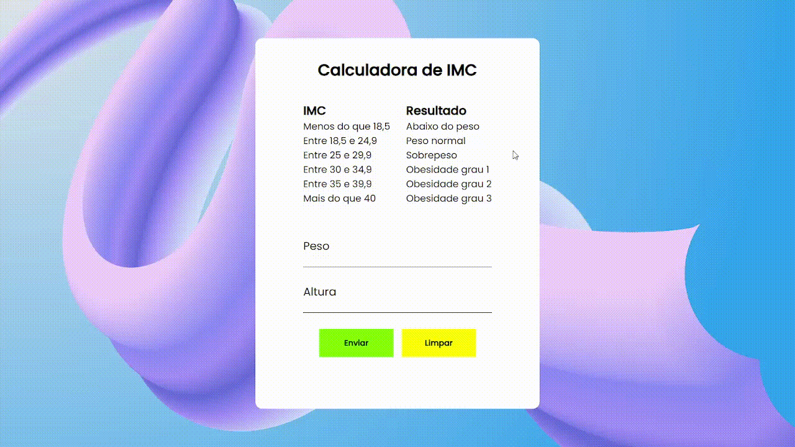

<h1 align="center"> Calculadora de IMC </h1>

# Objetivo
> Calcular o Imc de acordo com o seu peso/altura e
> utilizar lógica de programação para categorizar seu IMC.
# Linguagens
 * <h2>HTML</h2>
 * <h2>CSS</h2>
 * <h2>JS</h2>